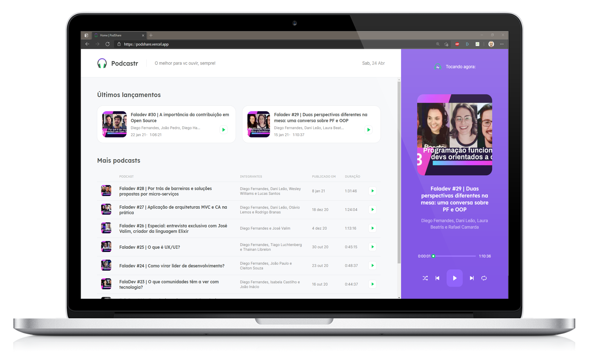

<h1 title="Move.It" align="center">
  
  PodShare
</h1>

<p align="center">
  <a href="#trophy-lessons-learned">Lessons Learned</a>&nbsp;&nbsp;&nbsp;|&nbsp;&nbsp;&nbsp;
  <a href="#rocket-technologies--resources">Technologies</a>&nbsp;&nbsp;&nbsp;|&nbsp;&nbsp;&nbsp;
  <a href="#hammer-setting-up-the-environment">Environment Setup</a>&nbsp;&nbsp;&nbsp;|&nbsp;&nbsp;&nbsp;
  <a href="#zap-features-implementations">Features</a>
</p>

<p align="center">
  

  

  

  
</p>

<p align="center">
  
</p>

Application developed during fifth edition of [Next Level Week](https://nextlevelweek.com/), delivered by [RocketSeat](https://rocketseat.com.br/). The objective was to build a frontend web application to share podcasts and listen to them. The project sought to implement the idea using **React.js** and the fantastic resources of **Next.js**.

[Check out the application running!](https://podshare.vercel.app/)

## :trophy: Lessons Learned

- Building a **React** application on top of **Next**, using TypeScript and SASS;
- File-based routing delivered by **Next**;
- Taking advantage of **Server Side Rendering** (SSR);
- Configuring and taking advantage of the **Static Site Generation** (SSG) and the AMAZING **Incremental Static Regeneration** (ISR);
- Easily handling audio with HTML and React Hooks;

## :rocket: Technologies & Resources

**Frontend:**
- [React.js](https://reactjs.org)
- [Next.js](https://nextjs.org/)
- [axios](https://github.com/axios/axios)

**Frontend/Backend:**
- [Next.js](https://nextjs.org/)
- [JSON Server](https://github.com/typicode/json-server)

**Development:**
- [Visual Studio Code](https://code.visualstudio.com/)
- Node.js routines with NPM
- TypeScript
- ESlint

## :hammer: Setting up the Environment

Make sure to have **Node.js 14+** installed in your machine and its `node` and `npm` shortcuts available through the command line, then use the following routines to run each part of the project:

```bash
$ npm install     # install required dependencies
$ npm start       # run JSON Server REST API in port 8081
$ npm run dev     # run Next development server in port 8080
$ npm run build   # build Next project tp production
$ npm run prod    # run Next server on built files (in port 8080)
```

## :zap: Features Implementations

The main idea of the project was developed during the week of the event and the result is the one found in [release v1.0](https://github.com/juliolmuller/podshare/releases/tag/v1.0). Afterwards, any incoming commits are intended to be incremental updates to improve the application, as proposed at the end of the event.

Besides, base project layout & design is available at **[Figma](https://www.figma.com/file/fDncpu5mCC4s3o4hHCpLZA/PodShare)**.

- [x] Create project using `create-next-app`;
- [x] And support to TypeScript;
- [x] And support to SASS;
- [x] Understand *Next* key functionalities and folders structure;
- [x] Define custom fonts based on *Figma* mock-ups;
- [x] Define base HTML document configuration in a *Next* app;
- [x] Create key *React* components;
- [x] Define routes and how to pass params through them;
- [x] Make use of *Next* component-level CSS modules;
- [x] Create *React Context* to handle podcasts playing (Player Context);
- [x] Create a *REST API* for available podcasts with *JSON Server*;
- [x] Configure *Next* to generate static pages that refreshes automatically within an interval;
- [x] Configure *Next* to generate static pages that contain dynamic data to be displayed;
- [x] Work with *HTML audio tag* and *React **useRef** hook* to play podcasts;
- [x] Configure controls to play, pause, play previous, play next, repeat and shuffle playlists;
- [x] Worked with a *slider* component;
- [x] Deploy application to Vercel's server;
- [ ] Make application responsive;
- [ ] Add animations and transitions;
- [ ] Add functionality to rate/like a podcast;
- [ ] Add functionality to share a podcast on social media;
- [ ] Add counter for number of times a podcast was listened to;
- [ ] Convert application into a PWA;

---

Also checkout the project developed in [NLW #2](https://github.com/juliolmuller/proffy), [NLW #3](https://github.com/juliolmuller/happy) and [NLW #4](https://github.com/juliolmuller/move.it).
